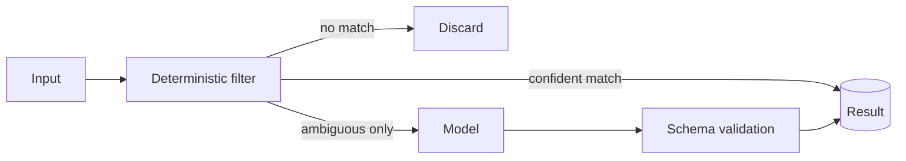

# Pipeline con la IA al final

[English](ai-last-pipeline.md) · **Español**

**Pon el modelo al final del pipeline, no en su entrada.**

## Forma

Tres etapas, en orden de coste creciente: descartar lo que es obviamente irrelevante, resolver
por reglas lo que las reglas pueden resolver y mandar al modelo solo el resto genuinamente
ambiguo. Lo que devuelva el modelo se valida contra un esquema antes de convertirse en dato.

## Qué optimiza

**Coste.** El gasto pasa a escalar con la fracción ambigua del tráfico en vez de con todo él.
En la carga de clasificación donde lo medimos, la reducción fue de aproximadamente un orden de
magnitud, porque la mayor parte del tráfico entrante ni siquiera era una petición.

**Superficie de ataque.** La entrada no confiable que nunca llega a un prompt no puede
desviarlo. El filtro es también una frontera.

**Explicabilidad.** Cuando decide una regla, puedes decir qué regla fue. Solo el residuo
necesita la respuesta «lo dijo el modelo».

## Qué cuesta

Un diccionario o un conjunto de reglas se convierte en un activo que hay que mantener. Se
degrada. El vocabulario cambia, las reglas dejan de casar y la fracción ambigua crece en
silencio — lo cual aparece como un aumento de coste, no como un error. **Instrumenta el reparto**
(porcentaje descartado / resuelto por reglas / resuelto por el modelo) y alerta cuando suba la
parte del modelo, o la deriva será invisible hasta que llegue la factura.

## Cuándo no usarlo

Cuando la entrada ya viene estructurada y homogénea: el filtro no tiene nada que separar y has
añadido una capa para nada. Y cuando la tarea es realmente generación abierta y no clasificación
o extracción: no hay capa de reglas que escribir.
