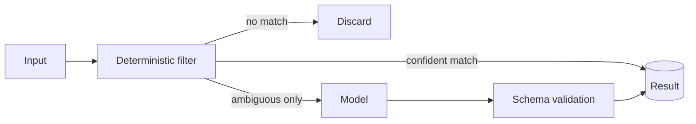

# AI-last pipeline

**English** · [Español](ai-last-pipeline.es.md)

**Put the model at the end of the pipeline, not at its entrance.**

## Shape

Three stages, in order of increasing cost: discard what is obviously irrelevant, resolve by
rules what rules can resolve, and send the model only the genuinely ambiguous remainder.
Whatever the model returns is validated against a schema before it becomes data.

## What it optimises for

**Cost.** The spend now scales with the ambiguous fraction of traffic instead of with all
of it. In the classification workload where we measured this, the reduction was roughly an
order of magnitude, because most inbound traffic was not a request at all.

**Attack surface.** Untrusted input that never reaches a prompt cannot steer one. The
filter is also a boundary.

**Explainability.** When a rule decided, you can say which rule. Only the residual needs
the "the model said so" answer.

## What it costs

A dictionary or rule set becomes a maintained asset. It drifts. Vocabulary changes,
the rules stop matching, and the ambiguous fraction silently grows — which shows up as a
cost increase, not as an error. **Instrument the split** (share discarded / rule-resolved /
model-resolved) and alert on the model share rising, or the drift is invisible until the bill.

## When not to use it

When the input is already structured and homogeneous — there is nothing for the filter to
separate, and you have added a layer for nothing. And when the task is genuinely open-ended
generation rather than classification or extraction: there is no rule tier to write.
