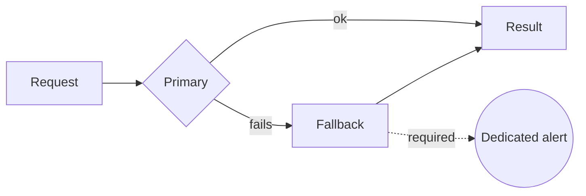

# Alertar en la ruta de fallback

[English](alert-on-the-fallback-path.md) · **Español**

**Todo mecanismo de resiliencia es un sitio donde un fallo puede ocurrir en silencio. Si el
fallback no tiene alerta propia, no has construido resiliencia: has construido silencio.**

## El patrón que no dejábamos de redescubrir

De forma independiente, en varios sistemas distintos, la misma forma:

- Una caché seguía sirviendo después de que su refresco hubiera dejado de funcionar.
- Un tope de paginación recortaba resultados en silencio, así que un recuento salía bajo pero nunca con pinta de estar mal.
- Un componente de red reportaba `READY` sin dejar pasar tráfico alguno.
- Un paso de enriquecimiento se autodesactivaba ante un error y dejaba pasar los registros sin enriquecer.

En todos los casos la ruta feliz estaba monitorizada y la de fallback no. El sistema seguía
en verde. La salida era incorrecta.

## La regla

**Que salte un fallback es un evento, no un no-evento.** Tiene su propia métrica y su propio
umbral — no la tasa de error del primario, que el fallback existe precisamente para enmascarar.

Forma práctica: cuenta las activaciones del fallback y alerta sobre la *tasa*, no sobre una
sola. Un fallback que salta de vez en cuando está haciendo su trabajo. Un fallback que salta
continuamente es el primario, y eso no lo decidió nadie.

## Qué cuesta

Alertas que hay que mantener con significado. Una alerta de fallback que salta constantemente
acaba silenciada, y una alerta silenciada es peor que ninguna alerta porque parece cobertura.

## Cuándo no usarlo

Cuando el fallback es semánticamente equivalente al primario — una segunda réplica del mismo
almacén, por ejemplo. Entonces su activación sí es un no-evento y alertar sobre ella es ruido.
