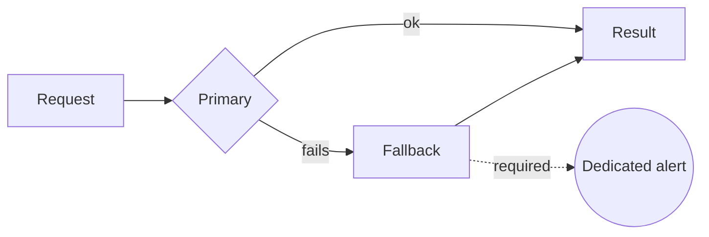

# Alerting on the fallback path

**English** · [Español](alert-on-the-fallback-path.es.md)

**Every resilience mechanism is a place where a failure can happen quietly. If the
fallback has no alert of its own, you have not built resilience — you have built silence.**

## The pattern we kept rediscovering

Independently, in several different systems, the same shape:

- A cache kept serving after its refresh had stopped working.
- A pagination guard capped results silently, so a count was low but never wrong-looking.
- A network component reported `READY` while passing no traffic.
- An enrichment step disabled itself on error and let records through unenriched.

In each case the happy path was monitored and the fallback path was not. The system stayed
green. The output was wrong.

## The rule

**A fallback that fires is an event, not a non-event.** It gets its own metric and its own
threshold — not the error rate of the primary, which the fallback exists to suppress.

Practical form: count fallback activations, alert on the *rate*, not on a single one. A
fallback that fires occasionally is working. A fallback that fires continuously is the
primary, and nobody decided that.

## What it costs

Alerts you have to keep meaningful. A fallback alert that fires constantly gets muted, and
a muted alert is worse than no alert because it looks like coverage.

## When not to use it

When the fallback is semantically equivalent to the primary — a second replica of the same
store, say. Then activation really is a non-event and alerting on it is noise.
