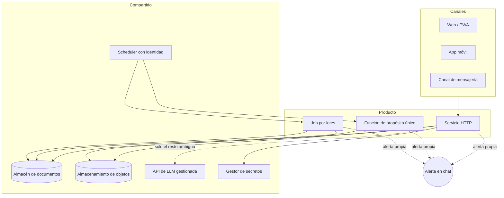

# Una plataforma pequeña, muchos productos

[English](shared-platform-blueprint.md) · **Español**

**Un portfolio de productos pequeños asistidos por IA sigue siendo operable cuando todos se
construyen con las mismas pocas piezas, y cada pieza tiene una única forma conocida de
fallar.**

## El patrón que seguimos redescubriendo

En pipelines de mensajería, asistentes conversacionales, un flujo de cobranza, una app
social móvil y herramientas internas de control, los sistemas convergieron en la misma forma
— no por decreto, sino porque cada desvío costó un incidente:

- **El trabajo con forma de petición corre en un contenedor gestionado; el trabajo con forma
  de tiempo, no.** Una API HTTP es un servicio. Un batch nocturno o un scraper es un job. El
  trabajo que continúa *después* de enviar la respuesta no pertenece ni a un manejador de
  petición ni a un servicio con CPU limitada.
- **Un almacén de documentos por producto**, con TTL en todo lo efímero, y almacenamiento de
  objetos para snapshots preagregados que se leen mucho más de lo que cambian.
- **El LLM es el último paso, no el primero.** Reglas deterministas baratas deciden lo que
  pueden; el modelo solo ve el resto ambiguo. Su salida es una cuarta ruta de código y se
  normaliza y valida como cualquier otra entrada.
- **Los schedulers llaman a los servicios con una identidad, no con un secreto compartido en
  una URL.** Quien llama es una cuenta de servicio, y quien recibe debería verificar la audiencia y el
  sujeto del token — una comprobación que acepta *cualquier* token válido del proveedor de
  identidad no es autenticación.
- **Cada producto alerta de su propia degradación**, a un canal de chat que una persona lee
  de verdad.

## La regla

Tres consecuencias que conviene decir, porque son lo que hace que la forma compense:

1. **El coste es predecible por producto.** Toda llamada al LLM está detrás de los mismos
   controles: un límite de tasa por usuario (no por IP — una oficina o un evento comparten
   una sola dirección), un tope diario y registro de tokens.
2. **Los modos de fallo son compartidos, así que las lecciones se transfieren.** Un arreglo
   encontrado en un producto es un punto de checklist para el resto. El
   [engineering handbook](../engineering-handbook/README.es.md) es en buena parte esa
   transferencia puesta por escrito.
3. **Un producto nuevo arranca ya muy avanzado.** Lo que queda es el dominio, no la fontanería.

## Qué cuesta

- **Acoplamiento a una nube.** La forma es portable en espíritu y no en detalle; mover un
  producto implica reexpresar la identidad del scheduler, el manejo de secretos y el almacén
  de documentos.
- **Una superficie de fallo compartida.** Un error en una plantilla de despliegue llega a
  todos los productos que la usan — ver
  [`secrets-flag-replaces-the-list`](../engineering-handbook/secrets-flag-replaces-the-list/README.es.md).
- **Presión hacia la uniformidad.** Algunos productos irían mejor con una base relacional o
  una cola, y la plataforma hace que la opción por defecto parezca gratis.

## Cuándo no usarla

- Un producto con informes relacionales pesados, o con consistencia estricta entre muchas
  entidades, donde el almacén de documentos pasa a ser contra lo que peleas.
- Cómputo sostenido y crítico en latencia, donde los contenedores que escalan a cero son la
  unidad equivocada.
- Un único sistema grande. La forma es para *muchos productos pequeños de un equipo
  pequeño*; no aporta nada a un monolito.

## Véase también

- [Pipeline con la IA al final](ai-last-pipeline.es.md)
- [Alertar en la ruta de fallback](alert-on-the-fallback-path.es.md)
- [`cloudrun-job-vs-service`](../engineering-handbook/cloudrun-job-vs-service/README.es.md)
