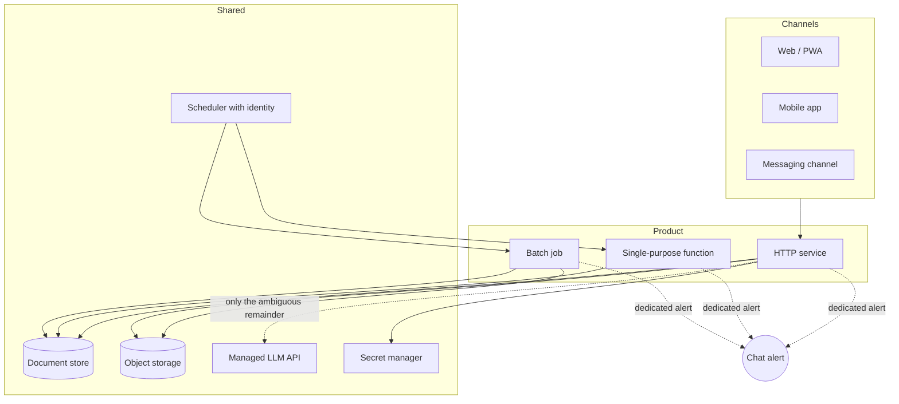

# One small platform, many products

**English** · [Español](shared-platform-blueprint.es.md)

**A portfolio of small AI-assisted products stays operable when every product is built from
the same few parts, and each part has one known way to fail.**

## The pattern we kept rediscovering

Across messaging pipelines, conversational assistants, a collections workflow, a mobile
social app and internal control tooling, the systems converged on the same shape — not by
decree, but because each deviation cost an incident:

- **Request-shaped work runs in a managed container; time-shaped work does not.** An HTTP
  API is a service. A nightly batch or a scraper is a job. Work that continues *after* the
  response was sent belongs in neither a request handler nor a service with throttled CPU.
- **One document store per product**, with TTLs on anything ephemeral, and object storage
  for pre-aggregated snapshots that are read far more often than they change.
- **The LLM is the last step, not the first.** Cheap deterministic rules decide what they
  can; the model sees only the ambiguous remainder. Its output is a fourth code path and is
  normalised and validated like any other input.
- **Schedulers call services with an identity, not a shared secret in a URL.** The caller is
  a service account, and the receiver should verify the token's audience and subject —
  a check that accepts *any* valid token from the identity provider is not authentication.
- **Every product alerts on its own degradation**, to a chat channel a human actually reads.

## The rule

Three consequences worth stating, because they are what makes the shape pay off:

1. **Cost is predictable per product.** Every LLM call sits behind the same controls: a
   per-user rate limit (not per-IP — an office or event shares one address), a daily cap, and
   token logging.
2. **Failure modes are shared, so lessons transfer.** A fix found in one product is a
   checklist item for the rest. The [engineering handbook](../engineering-handbook/README.md)
   is mostly that transfer written down.
3. **A new product starts most of the way there.** The remaining work is the domain, not the plumbing.

## What it costs

- **Coupling to one cloud.** The shape is portable in spirit and not in detail; moving a
  product means re-expressing the scheduler identity, the secret handling and the document
  store.
- **A shared failure surface.** A mistake in a deploy template reaches every product that
  uses it — see [`secrets-flag-replaces-the-list`](../engineering-handbook/secrets-flag-replaces-the-list/README.md).
- **Uniformity pressure.** Some products would be better with a relational database or a
  queue, and the platform makes the default feel free.

## When not to use it

- A product with heavy relational reporting, or hard consistency across many entities, where a
  document store becomes the thing you fight.
- Sustained, latency-critical compute, where scale-to-zero containers are the wrong unit.
- A single large system. The shape is for *many small products by a small team*; it adds
  nothing to a monolith.

## See also

- [AI-last pipeline](ai-last-pipeline.md)
- [Alerting on the fallback path](alert-on-the-fallback-path.md)
- [`cloudrun-job-vs-service`](../engineering-handbook/cloudrun-job-vs-service/README.md)
